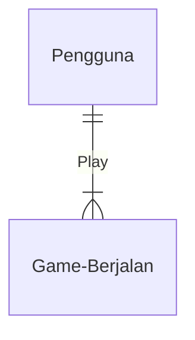
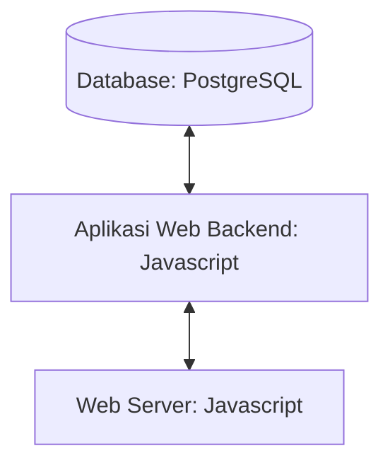
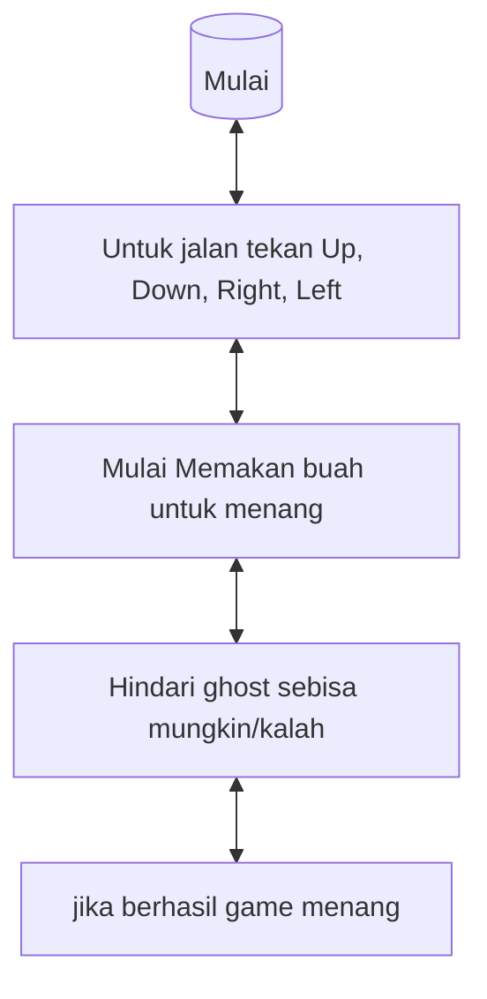

## 1.1 Latar Belakang

Disini saya Membuat Website Game, dan alasan saya membuat game tersebut dikarenakan game tersebut dari segi backstorynya agar kita bisa belajar dari game tersebut bahwa untuk mencari ilmu maka kita harus terus bergerak tanpa ragu
     
Proses Pembangunan Teknologi Informasi secara umum mengikuti Web Development Life Cycle :

   - Analysis

     Analisis adalah tahapan ketika kita mencoba menganalisa website seperti apa akan dibuat

   -	Design

    	Setelah itu saya akan mencoba mendesain sketsa dari website saya, kemudian didesain dengan saya gambar agar memudahkan penggambarannya

   -	Development
     Setelah desain dan menentukan teknologi apa saja yang akan digunakan, kemudian saya akan mencoba mengaplikasikan desain tadi ke kodingan. Mulanya saya akan membuat struktur dasar menggunakan HTML, kemudian diberikan style menggunakan,dan JavaScript

   - Testing & Review

     Setelah ketiga tahapan tadi, website yang sudah hampir selesai ditest terlebih dahulu, diperiksa semuanya dan dicari kesalahannya bila ada. Setelah itu saya mencoba meminta review ke orang lain untuk memberikan pendapat dan kritik mereka guna mempermudah saya menemukan letak kesalahan saya bila ada.

   - Deployment

     Setelah website saya dipastikan sempurna dan tidak ada kesalahan, juga sudah mendapatkan review yang baik, maka saya akan upload websitenya di akun github saya, yang kemudian akan saya posting ke internet. Sehingga website saya bisa diakses melalui internet.

   - Maintenance

     Setelah berhasil mengupload websitenya, sekarang tinggal tahapan maintenance. Setelah mendeploy website untuk beberapa hari, saya akan mencoba cek apakah ada kerusakan atau pun kesalahan ketika mengakses website saya dari internet browser.

## 1.2. Deksripsi Teknologi Informasi

Didalam website ini akan terdapat game yang saya buat

Backstory
Game ini menceritakan kisah seseorang yang ingin mencari ilmu dengan sungguh sungguh dimanapun dia berada, namun tantangan terbesarnya adalah dia masih terbiasa dengan kemalasannya serta banyaknya ia membuat alasan sehingga terus menunda apapun yang ingin dia capai, maka dia mau tidak mau jika ingin mendapatkan apa yang dia inginkan maka ia harus terus bergerak tanpa henti untuk terus mencoba meraih apa yang ingin dia capai dengan terus menghindari apapun cobaan terutama sifat malasnya.

•	Merk = Move & out (Berdasarkan backstory)
•	Campaign : Bagaimana membuat aplikasi yang menyenangkan bagi penggunanya

•	Target User :

    o	Usia 12+
    
    o	Orang yang senang dengan game tantangan
    
    o	Orang yang ingin melihat referensi Game
    
       
    •	User Experience :
    
    o	Mudah
    
    o	Menarik
    
    o	Sederhana
    
    o	Menginspirasi
    
    o	Warna : warna biru, background hitam

Genre :

    o	Action Maze Chase
    
     o	Action Game

- Inspirasi Desain :

## 2. User Story

Sebagai | Saya ingin bisa | Sehingga | Prioritas
---|---|---|---
pengguna | Menggerakkan Player dengan Keyboard  | bisa memencet tombol Up Down Right Left | ⭐⭐⭐⭐⭐
pengguna | Memunculkan buah untuk score  | bisa memunculkan buah | ⭐⭐⭐⭐⭐
pengguna | Player memakan buah yang ada / score  | bisa memakan buah yang ada di map | ⭐⭐⭐⭐⭐
pengguna | Memunculkan ghost untuk mengejar Player  | bisa memunculkan ghost untuk mengejar | ⭐⭐⭐⭐⭐
pengguna | Melihat pergerakkan Ghost bergerak   | bisa melihat pergerakkan ghost  | ⭐⭐⭐⭐⭐
pengguna | Menampilkan papan Score | bisa menampilkan papan score | ⭐⭐⭐⭐
pengguna | Menampilkan jumlah nyawa yang ada  | bisa memunculkan nyawa | ⭐⭐⭐⭐
pengguna | Memulai kembali game tanpa memulai score dari awal  | bisa memulai kembali game | ⭐⭐⭐⭐⭐
pengguna | Meningkatkan kesulitan game seiring berjalan waktu  | bisa meningkatkan kesulitan game | ⭐⭐⭐⭐⭐

## 3. Struktur Data

Cara membuat aneka macam bentuk grafik menggunakan mermaid.js bisa lihat di [https://mermaid.js.org/syntax/entityRelationshipDiagram.html](https://mermaid.js.org/syntax/entityRelationshipDiagram.html) 

## 4. Arsitektur Sistem

Masih pake mermaid.js juga bisa lihat flowchart di [https://mermaid.js.org/syntax/flowchart.html](https://mermaid.js.org/syntax/flowchart.html)

## 5. Teknologi, Library, dan Framework

di project ini saya menggunakan Visual Studio Code sebagai teknologi pendukung saya

## 6. Desain User Experience dan User Interface

tampilannya 

 ## 7.Flowchart Algoritma

## 8. Demonstrasi Video

https://youtu.be/zpjuXEVMO8U?si=wRZQf5GoNYeCHRfr

## 8. Code Game

Link youtube nya di detik jawaban ini

## 9. Bagaimana algoritma, struktur data, dan bahasa pemrograman berperan dalam Game ?

ALGORITMA
1. mulai game
2. makan titik - titik kuning sampai habis untuk menang
3. begitu game mulai maka ghost akan muncul bertebaran juga secara random 
4. hindari ghost yang bertebaran di sekitar
5. jika terkena ghost maka game mengulang diawal sebanyak nyawa yang ada dan hanya merubah posisi ke semula tidak dengan score yang didapatkan
6. jika nyawa habis maka game selesai dan mode game kembali ke pengaturan awal
7. begitupun sebaliknya jika titik- titik kuning habis disaat nyawa masih tersisa maka game menang dan game akan kembali ke semula

STRUKTUR DATA
1. 

